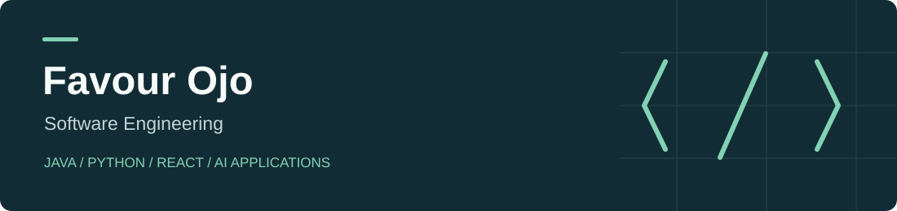

I am a software engineer with five years of combined experience in software development, IT leadership and technical support. I build backend APIs, web interfaces, and AI-enabled applications. My work combines **Java/Spring Boot**, **Python**, **React**, and **SQL**, with an emphasis on clear requirements, reliable integrations, and code that can be tested and explained.

Based in Hamilton, Ontario · B.Sc. Software Engineering, Babcock University · [Pragra Full Stack Java Developer Course](https://pragra.io/courses/java-full-stack-development), 2024

## Development experience

**ProxiMeet — Software Engineer / Developer (part-time), January 2025 - Present**
Developed a proximity-networking application with authentication and messaging workflows. Built React/TypeScript administration views with typed API access, routing and session handling, and developed the responsive marketing and waitlist website. Worked with UI/UX collaborators to translate requirements into application features. The application and admin source remain private.

**Readington School — Head of IT, August 2022 - June 2024**
Developed and maintained school websites and internal software, including employee registration and student results-upload workflows. Supported the payment gateway and student/staff database, led IT operations, and configured student and employee workstations.

**Cerebral and Dexter Ltd. — Software Developer Intern, February 2021 - June 2022**

 Built the It Is Time election campaign website in Nigeria and contributed Java/Spring Boot REST APIs, PostgreSQL data structures and web interfaces for Historified.tv.

**Freelance web development — June 2023 - Present**
Built responsive HTML/CSS/JavaScript websites with API integrations and e-commerce features for client requirements.

**Concentrix — Technical Support Advisor, August 2025 - Present**

Diagnose application, operating-system, authentication and cloud-sync issues across mobile and desktop devices for a major consumer technology client. Isolate faults through structured troubleshooting, validate fixes and document reproduction steps, system context and escalation findings.

## Selected projects

### [Transaction Lab](https://github.com/Sevyn1/transaction-lab)

A complete local expense-ledger demo: validated Java/Spring Boot API, SQL migrations, React dashboard, and Python CSV ingestion. Uses decimal arithmetic for money, rejects duplicate references, and reports invalid imports.

**Java · Spring Boot · JDBC · SQL · React · Python**

[Architecture and setup](https://github.com/Sevyn1/transaction-lab#stack-and-architecture) · [Tests](https://github.com/Sevyn1/transaction-lab/actions) · [API examples](https://github.com/Sevyn1/transaction-lab#api-examples)

### [Spring Registration — Account Workspace](https://github.com/Sevyn1/spring-registration-private)

Consolidated Java account application with validated email registration, BCrypt password storage, SQL migrations, private profile editing and password-confirmed settings. Includes session authentication, CSRF protection and migration preservation, with browser profile editing and persistence checks.

**Java · Spring Security · JDBC · Flyway · SQL · JavaScript**

[Design decisions](https://github.com/Sevyn1/spring-registration-private/blob/main/docs/DESIGN.md) · [Tests](https://github.com/Sevyn1/spring-registration-private/actions) · [Preview and setup](https://github.com/Sevyn1/spring-registration-private)

### [ShipCarte Freight Review](https://github.com/Sevyn1/shipcarte-freight-review)

Reviewed Java course-project freight module with a working browser calculator, precise unit conversions and input validation. Original baseline and contributor credits are retained.

**Java · Maven · JUnit · numerical validation**

### [Stark — Employee and Task Management](https://github.com/Sevyn1/stark)

Consolidated Flutter/Firebase employee-management application with real account sign-in, scoped projects/tasks, employee self check-in/checkout, manager attendance review, searchable teammates, private conversations and team text messages. Modernized the Flutter implementation and enforced workspace and private-message access through Firestore security rules. Owned Firebase backend checked through signup, workspace creation, invitations, task completion and direct-message delivery. Live uploads are disabled for the Spark plan; local emulator uploads remain available.

**Dart · Flutter · Firebase · Firestore · Riverpod**

### [Reverse Dictionary AI](https://github.com/Sevyn1/reverse-dictionary-ai)

A description-to-word application with a Python/FastAPI API and React interface. AI search suggests words beyond the SQLite catalog, validates generated word/definition results, and transparently falls back to local search after provider failures.

**Python · FastAPI · SQLite · React · OpenAI integration**

[How it works](https://github.com/Sevyn1/reverse-dictionary-ai#implementation) · [Tests](https://github.com/Sevyn1/reverse-dictionary-ai/actions) · [Setup](https://github.com/Sevyn1/reverse-dictionary-ai#run-the-app)

### [Repository Development Agent](https://github.com/Sevyn1/repo-dev-agent)

Recovered Python developer tooling with repository discovery, bounded file access, reviewed patches and backups, explicit command/image approval, and SQLite session memory. Tests cover the local tools and mocked provider request handling.

**Python · OpenAI Agents SDK · SQLite · CLI tooling**

[Setup and tool boundaries](https://github.com/Sevyn1/repo-dev-agent#run-without-a-key) · [Tests](https://github.com/Sevyn1/repo-dev-agent/actions) · [Design decisions](https://github.com/Sevyn1/repo-dev-agent/blob/main/docs/DESIGN_DECISIONS.md)

### [ProxiMeet website](https://github.com/Sevyn1/Proximeet-Website)

Responsive marketing and waitlist frontend with asynchronous form feedback, shared styling, and reduced-motion-aware interactions. Part of my broader ProxiMeet application work, including a private React/TypeScript admin dashboard.

**JavaScript · HTML · CSS**

[Website](https://sevyn1.github.io/Proximeet-Website/) · [Source](https://github.com/Sevyn1/Proximeet-Website)

### [It Is Time — Campaign Archive](https://github.com/Sevyn1/it-is-time-campaign-website)

Restored campaign website with responsive navigation, searchable policy topics, keyboard-accessible gallery viewing and on-demand video. Originally built during my software development internship in Nigeria; recently restored navigation, gallery and media behavior while preserving campaign material and source history.

**HTML · CSS · JavaScript · Static content**

## Additional application work

**[iWord](https://github.com/Sevyn1/iWord)** — React/Next.js and TypeScript sermon platform with Supabase/PostgreSQL integration, RSS ingestion, OpenAI transcription, and retrieval-augmented Q&A implementation with timestamped sources. The application is in development; live-service verification is tracked separately.

**ProxiMeet admin** — React/TypeScript administration interface with typed API access, explicit demo modes, session-state validation, and automated checks. Private application source stays private.

## Engineering approach

I define requirements, break work into reviewable changes, read the implementation, and check results with automated tests and example flows. I use Codex to assist with implementation, debugging and documentation while keeping design decisions and validation visible.

Project READMEs record shared-source history, recent maintenance, test coverage and development limits. Live-service verification is documented separately from mocked-provider tests.

## Technical focus

| Area | Technologies and practice |
| --- | --- |
| Backend | Java, Spring Boot, Python, FastAPI, REST APIs |
| Web | JavaScript, React project work, TypeScript, HTML/CSS |
| Data | SQL, PostgreSQL/Supabase, SQLite, schema migrations |
| AI applications | OpenAI integrations, transcription, retrieval and citation handling |
| Delivery | Git, automated tests, CI, Docker project exposure |

Current focus: Java APIs, React interfaces, Python integrations, and maintainable application workflows.
